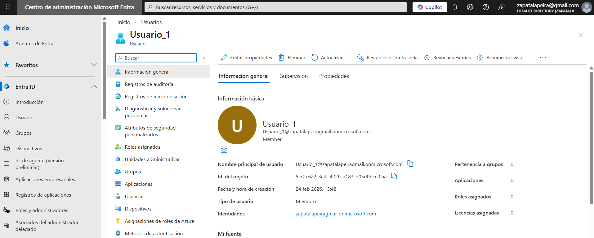
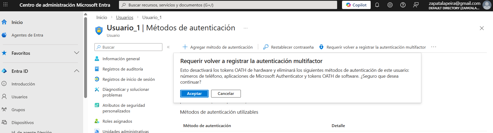

# Lab 27 – Incidencia: Recuperación de acceso por bloqueo de MFA

## Objetivo
Simular un caso real de soporte donde un usuario pierde acceso por un problema con MFA y debe ser recuperado por un administrador sin necesidad de usar una cuenta break-glass.

## Qué ha pasado (incidencia)
El usuario no puede completar el segundo factor de autenticación y se queda sin acceso. Este escenario es habitual cuando se pierde el móvil, cambia el dispositivo o el método MFA deja de funcionar.

## Resolución
He utilizado una cuenta administrativa con permisos suficientes para forzar que el usuario vuelva a registrar sus métodos de autenticación multifactor. Después he validado que el usuario puede volver a iniciar sesión correctamente.

## Nota importante
En un caso normal, esta incidencia se resuelve con una cuenta administrativa estándar.  
La cuenta **break-glass** quedaría reservada para una emergencia mayor, por ejemplo si también el acceso administrativo habitual estuviera bloqueado por una directiva o por un fallo general de MFA.

## Evidencias

### 01 – Usuario afectado / contexto del problema

Se muestra el usuario sobre el que se va a realizar la recuperación del acceso.

---

### 02 – Administrador forzando re-registro de MFA

Se muestra la acción administrativa para obligar al usuario a volver a registrar sus métodos de MFA.

---

### 03 – Usuario recuperado

Se muestra la validación final del caso: el usuario vuelve a iniciar sesión o aparece ya preparado para registrar de nuevo su MFA.

## Qué diría en entrevista
“Si un usuario se bloquea por MFA, lo normal es que un administrador le fuerce el re-registro del método. Las cuentas break-glass no se usan para incidencias normales, sino como mecanismo de continuidad de acceso para emergencias mayores.”
